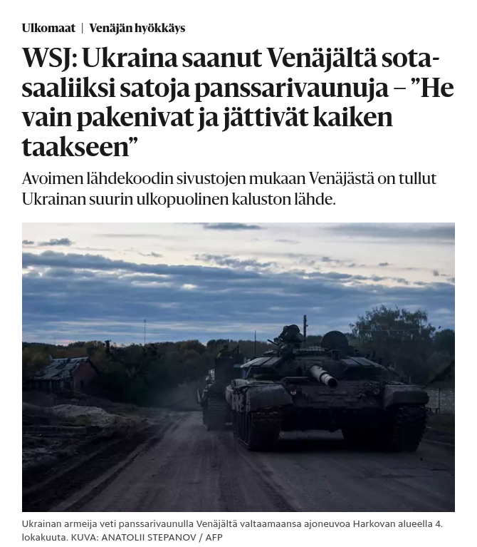

Venäjästä on tullut Ukrainan suurin ulkopuolinen kaluston lähde.

> Avoimen lähdekoodin sivustojen mukaan Venäjästä on tullut Ukrainan suurin
> ulkopuolinen kaluston lähde.

([hs.fi 6.10.2022](https://www.hs.fi/ulkomaat/art-2000009116473.html))

[]
